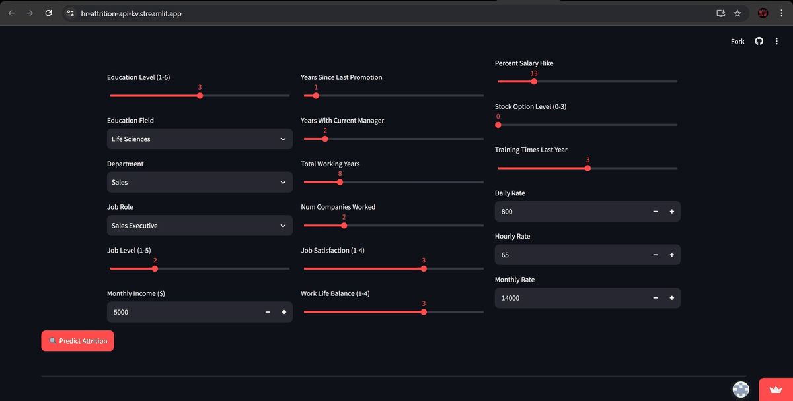

  <h1>🧑‍💼 HR Attrition Prediction & Risk Analysis</h1>
  &nbsp;&nbsp;&nbsp;&nbsp;
  
<em>Predicting employee flight-risk using XGBoost and Survival Analysis, powered by a Snowflake Cloud Data Warehouse.</em>

---

## Screenshots

  

## 🚀 Live Deployments

| 🌐 Application | 🔗 Link |
|:---|:---|
| **REST API** | [hr-attrition-api.onrender.com](https://hr-attrition-api-qzeq.onrender.com) |
| **API Docs (Swagger)** | [Interactive Swagger UI](https://hr-attrition-api-qzeq.onrender.com/docs) |
| **Streamlit Web App** | [Live Dashboard](https://hr-attrition-api-kv.streamlit.app) |

## 🌟 Key Features & Unique Additions
- ❄️ **Snowflake Data Warehouse Integration:** Automated ETL pipelines streaming structured employee records into a cloud data warehouse for real-time risk profiling.
- ⏳ **Survival Analysis (Kaplan-Meier):** Answers *when* employees are likely to leave, not just *if*. Log-rank tests confirm OverTime employees leave significantly earlier (p < 0.0001).
- 💸 **Cost of Attrition Calculator:** Dynamically computes replacement costs (industry-standard 150% of annual salary) mapped across departments and seniority.
- 🎯 **SHAP Model Explainability:** Explains the localized driving factors behind *every single individual's* attrition probability prediction.
- 📊 **SQL Risk Profiling:** Advanced SQL analysis using CTEs and Window Functions directly inside Snowflake to compute quartile risk rankings.

## 🛠️ Technology Stack
XGBoost · Scikit-Learn · Lifelines · SHAP · SMOTE · Snowflake · Pandas · SQL · FastAPI · Docker · Uvicorn · Streamlit · Power BI

## 📈 Model Performance
| Model | AUC Score |
|:---|:---|
| Logistic Regression | ~0.72 |
| Random Forest | ~0.75 |
| Gradient Boosting | ~0.77 |
| **XGBoost (Tuned)** | **~0.79** 🏆 |

## 💡 Key Business Insights
1. **Overtime Burnout:** Employees working overtime have the steepest survival curve decline from Year 1.
2. **Promotion Stagnation:** The highest attrition bracket correlates heavily with employees stagnant for 5+ years without promotion.
3. **Management Friction:** New manager relationships (0–1 year tenure) spark dramatic attrition spikes.
4. **Compensation Matrix:** Top overall SHAP drivers are OverTime, MonthlyIncome, and JobSatisfaction.

---

  <b>Built by Kavin Venkat</b>  
  <a href="https://www.linkedin.com/in/kvsherly17100210">LinkedIn</a> • <a href="https://github.com/KV0217">GitHub</a>

